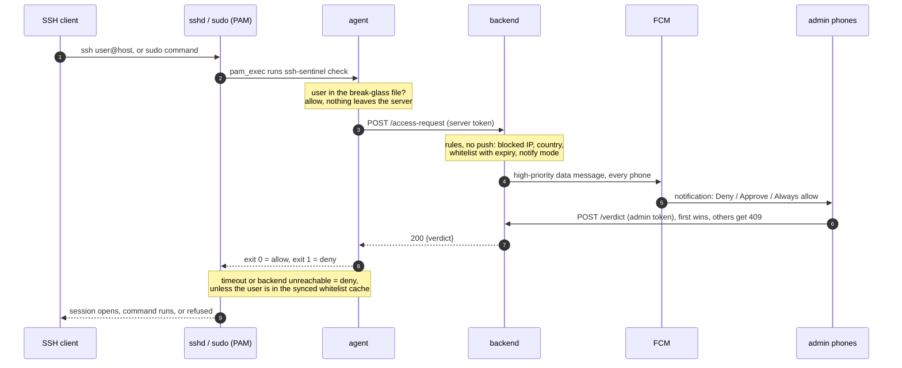
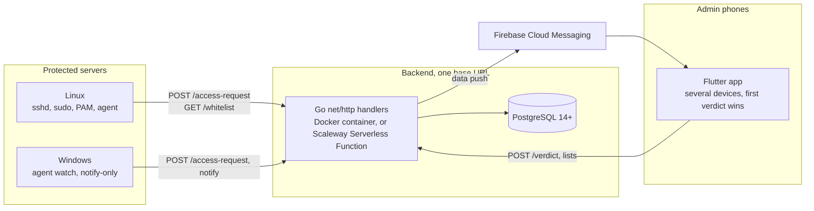

# ssh-sentinel

Human approval of SSH logins and sudo, in real time, from your phone. A small agent hooks into PAM on every protected server; each login or sudo sends a push notification to the admins' phones, and one tap approves or denies it. No answer within 30 seconds means no access, and a backend that cannot be reached means no access for anyone who is not already trusted: the whole thing fails closed. The backend is plain Go and runs anywhere, as one Docker container next to any PostgreSQL, or on Scaleway Serverless Functions, with nothing else to operate.

## Features

- **SSH and sudo approval.** PAM `account` hook for both, so the admins are only asked about logins that would otherwise succeed. sudo requests carry the command line.
- **Break-glass.** A root-only local file of users who always get in, checked before any network call. The escape hatch when the backend is down.
- **Whitelist with TTL.** "Always allow" from the phone creates an entry for that user and context, for one server or all, for 1 hour, 24 hours, a custom duration or permanently. Synced to the servers so it keeps working through a backend outage until it expires.
- **Multi-admin, first verdict wins.** Every registered phone gets the push; the first answer decides, the others see who did.
- **Auto-block.** Repeated admin denials from one IP block it fleet-wide, no push. Unblock from the app.
- **Geo rules.** Country blocklist, evaluated before the push.
- **fail2ban.** Stable syslog line format and a shipped filter, for the per-server layer.
- **Notify-mode rollout.** Install a server in observe mode, watch the history, then switch to enforce. No lockout surprise.
- **Windows, notify-only.** An event-log watcher reports logins on Windows servers.
- **Cloud-portable backend.** Core `net/http` handlers, one frozen API contract, PostgreSQL 14+ with no provider-specific SQL. Docker anywhere, or Scaleway serverless through a thin adapter.
- **Flutter Android app.** Notification with Deny / Approve / Always allow buttons that work from the lock screen, plus history, whitelist, blocked IPs, geo rules and settings screens.

Tech stack: Go, PostgreSQL, Terraform, Flutter, FCM.

## How it works



Flow, database schema, the frozen API contract, auth model and failure modes are in [docs/architecture.md](docs/architecture.md).

## Deployment view



## Quickstart

The docker-compose path: backend and PostgreSQL on one machine, TLS by Caddy. From the repository root (PowerShell):

```powershell
cd infra\docker-compose
copy .env.example .env                  # fill in POSTGRES_PASSWORD, ADMIN_TOKEN, FCM_PROJECT_ID, FCM_SERVICE_ACCOUNT_JSON, DOMAIN
docker compose --profile tls up -d --build
curl https://<DOMAIN>/healthz           # {"status":"ok","db":"ok"}

docker compose exec backend /server enroll --name web-01     # prints the server token once
# on the server, in notify mode first:
#   sudo ./scripts/install.sh --backend-url https://<DOMAIN> --token "<server token>" --mode notify
# on the phone: install the app, Settings > backend URL and ADMIN_TOKEN, save
```

Full guides: [infra/README.md](infra/README.md) for both deployments (compose and Scaleway Terraform), [agent/TESTING.md](agent/TESTING.md) for the servers, [mobile/TESTING.md](mobile/TESTING.md) for Firebase setup and the phones.

## Security model

Details in [docs/architecture.md, section 6](docs/architecture.md#6-auth-model).

- **Fail-closed.** Backend unreachable, timeout, bad token, crashing agent: every failure ends in deny, except for break-glass users and unexpired whitelist entries in the local cache.
- **Tokens hashed, compared in constant time.** One bearer token per server, only its SHA-256 in the database. A database dump yields no usable token. Revocation replaces the hash.
- **Break-glass is an offline escape hatch.** Root-only file, never synced, never leaves the server, checked before any network call. Keep it to one or two accounts.

## Project status

Code complete, with unit tests on every component: 41 test functions in the agent, 202 in the backend, 132 in the mobile app. `go vet`, `go test`, `flutter analyze` and `flutter test` are clean.

End-to-end validation on real servers is in progress: Ubuntu and Rocky VMs for SSH and sudo, a Windows VM in notify-only mode, two phones. The runbooks are [agent/TESTING.md](agent/TESTING.md), [backend/TESTING.md](backend/TESTING.md) and [mobile/TESTING.md](mobile/TESTING.md). Scope and what is deliberately out of it: [docs/roadmap.md](docs/roadmap.md).

## Repository layout

| Folder | What | Docs |
|---|---|---|
| `agent/` | Go binary installed on servers: PAM hook for ssh and sudo, Windows watcher, installer, fail2ban filter | [agent/README.md](agent/README.md) |
| `backend/` | Go API: core handlers, container entrypoint, Scaleway adapter, SQL migrations | [backend/README.md](backend/README.md) |
| `infra/scaleway/` | Terraform for the reference deployment on Scaleway | [infra/README.md](infra/README.md) |
| `infra/docker-compose/` | Universal deployment: backend container + PostgreSQL | [infra/README.md](infra/README.md) |
| `mobile/` | Flutter app, Android first | [mobile/README.md](mobile/README.md) |
| `docs/` | architecture, frozen contract, roadmap, development workflow | [docs/](docs/) |

## Contributing

Git flow: feature branches off `develop`, conventional commit messages, one git worktree per parallel task ([docs/development.md](docs/development.md)). Never test PAM changes on a production server; use a throwaway VM and keep a root shell open while you do.

## License

Apache License 2.0, see [LICENSE](LICENSE).
